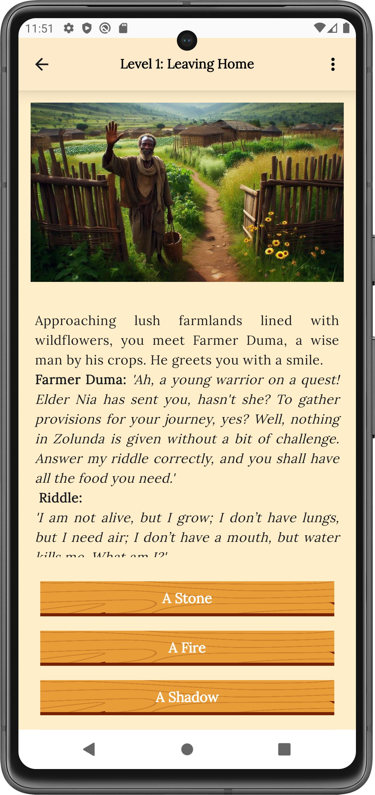
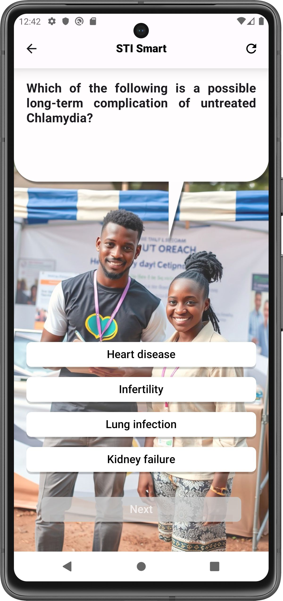
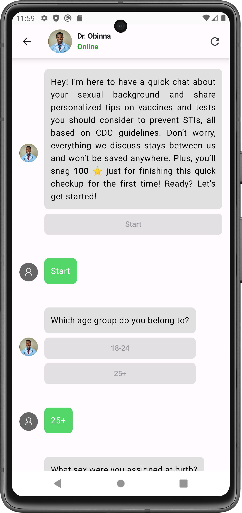
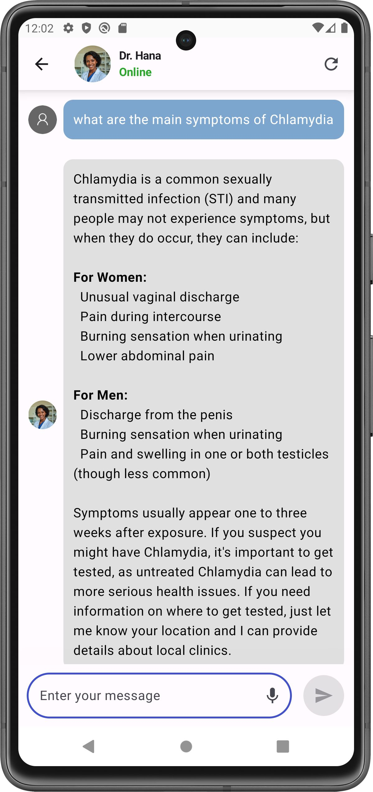
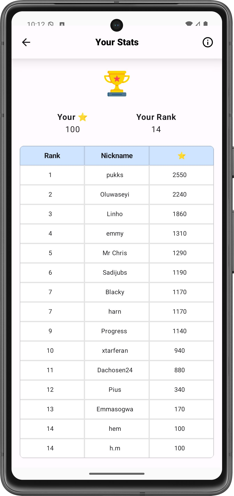

<p align="center">
  
</p>

<h1 align="center">STI Shield</h1>

<p align="center">
  
  
  
</p>

STIShield is a native Android mHealth application built in **Kotlin** and **Jetpack Compose** using an **MVVM architecture**, designed to deliver gamified and chatbot-driven STI education to young adults, with a focus on African audiences. It integrates LLM-based and rule-based chatbots to provide an engaging, consistent, and personalized experience.

## Features

- **Knowledge Quest** — Text-based adventure game where users progress through a story by completing tasks, solving challenges, and unlocking “Scrolls of Health” that deliver structured STI education from trusted sources (e.g., CDC, WHO).  

- **STI Smart** — Rule-based chatbot featuring African volunteer personas that present interactive quiz games across multiple difficulty levels, covering STI transmission, prevention, and common misconceptions.   

- **Health Guard** — Rule-based chatbot that conducts a personalized assessment and generates STI testing and vaccination suggestions based on user inputs and clinical guidelines (e.g., CDC). 

- **Safe Talk** — LLM-based chatbot that allows users to converse with selectable doctor personas (i.e., male or female), providing guidance on sexual health topics through interactive, adaptive responses. 

- **Leaderboard & Points System** — Users earn points by completing in-app activities (e.g., playing games,  finishing assessments, active usage time), and are ranked on a leaderboard to encourage continued engagement.  

- **User Guidance & Engagement** — Onboarding flow introducing app features, daily reminder notifications to promote continued use, and built-in support options (e.g., reporting issues) to improve usability and retention.  

## Screenshots

<div style="width: 100%; overflow-x: auto; white-space: nowrap;">
  <table style="min-width: 1000px; table-layout: fixed; width: 100%;">
    <thead>
      <tr>
        <th>Knowledge Quest</th>
        <th>STI Smart</th>
        <th>Health Guard</th>
        <th>Safe Talk</th>
        <th>Leaderboard</th>
      </tr>
    </thead>
    <tbody>
      <tr align="center">
        <td></td>
        <td></td>
        <td></td>
        <td></td>
        <td></td>
      </tr>
    </tbody>
  </table>
</div>

## Tech Stack

### Core
- **Language:** Kotlin  
- **UI:** Jetpack Compose, Material 3, Navigation Compose  
- **Architecture:** MVVM, Repository pattern  
- **Async:** Kotlin Coroutines  

### Backend & APIs
- **Firebase Firestore** — user data, scores, usage tracking  
- **OpenAI Assistants API** (via [openai-kotlin](https://github.com/aallam/openai-kotlin))  

### Data Handling
- **Kotlinx Serialization / JSON** — structured app content  

### Local & System
- **SharedPreferences** — lightweight local persistence  
- **Android Components:** Service (usage tracking), BroadcastReceiver (reminders), AlarmManager (notifications)  


## Project Structure

```
app/src/main/java/com/hemad/stishield
├── ui/
│   ├── screens/        # Feature screens built with Compose
│   ├── theme/          # App styling (colors, typography)
│   └── utilities/      # Reusable UI components
│
├── viewmodels/         # UI state management and interaction logic
│
├── model/
│   ├── chat/           # SafeTalk logic
│   ├── quiz/           # STI Smart logic
│   ├── game/           # Knowledge Quest logic
│   ├── riskassessment/ # Health Guard logic
│   ├── leaderboard/    # Leaderboard logic
│   └── common/         # Shared logic (user data, Firebase, notifications)
│
└── MainActivity.kt     # Entry point and navigation setup
```


## Setup

### Prerequisites
- Android Studio
- Android SDK 24+
- Firebase project with Firestore configured
- OpenAI API access and two configured assistant IDs

### Local configuration
Create or update `local.properties` with:

```properties
OPENAI_API_KEY = your_openai_api_key
FIRST_ASSISTANT_ID = your_first_assistant_id
SECOND_ASSISTANT_ID = your_second_assistant_id
```

### Build and run
1. Clone the repository
2. Open the project in Android Studio
3. Add your Firebase configuration and local properties
4. Sync Gradle
5. Run on an emulator or Android device

## License

Copyright (c) 2026 Hemad Fetrati

All rights reserved.

This project is provided for educational and portfolio purposes only.
No part of this codebase may be copied, modified, distributed, or used for commercial purposes without explicit permission from the author.


## Assets & Attribution

This project includes third-party assets:

* Some illustrations were generated using Microsoft Designer (AI-generated content).
* Icons are sourced from Flaticon and Freepik.

These assets are used under their respective licenses and remain the property of their original creators.

## Author

**Hemad Fetrati**

[](https://www.linkedin.com/in/hemadfetrati/)
[](mailto:sti.shield.app@gmail.com)
